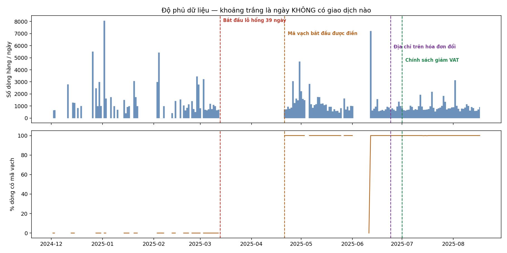

# Chương 3 — Dữ liệu

## 3.1 Dữ liệu đến từ đâu?

Dữ liệu là hóa đơn điện tử của một cửa hàng tiện lợi tại TP.HCM. File nguồn được lưu với tên `60.xlsx`, gồm một bảng thông tin hóa đơn và một bảng chi tiết từng dòng hàng. Hai bảng nối với nhau bằng mã hóa đơn.

Mỗi dòng chi tiết cho biết mặt hàng, số lượng, thành tiền, thuế suất và mã vạch. Mã vạch được dùng để nhận diện SKU, tức một mã hàng cụ thể. Giá trong phân tích là giá của SKU trên hóa đơn, không phải giá trung bình của cả cửa hàng.

Dữ liệu trải từ **12/2024 đến 08/2025**. Bảng chi tiết ban đầu có **233.996 dòng hàng**. Sau các bước lọc, mẫu dùng cho phân tích chính còn **82.109 dòng hàng**. Tên file nguồn, dấu vân tay của file và phiên bản môi trường chạy được lưu trong [manifest tái lập](../ket-qua/manifest-tai-lap.json).

## 3.2 Độ phủ dữ liệu không đều

Bảng dưới đây cho thấy số ngày, số hóa đơn và tình trạng mã vạch theo tháng. Số liệu lấy từ [bảng độ phủ theo tháng](../ket-qua/eda-do-phu-theo-thang.csv).

| Tháng | Ngày có dữ liệu | Hóa đơn | Dòng hàng | Dòng có mã vạch | SKU |
|---|---:|---:|---:|---:|---:|
| 12/2024 | 13 | 31 | 21.564 | 0,0% | — |
| 01/2025 | 12 | 34 | 22.842 | 0,0% | — |
| 02/2025 | 18 | 6.554 | 25.512 | 0,0% | — |
| 03/2025 | 11 | 4.498 | 11.572 | 0,0% | — |
| 04/2025 | 10 | 4.954 | 16.212 | 100,0% | 1.994 |
| 05/2025 | 28 | 12.481 | 31.890 | 100,0% | 2.357 |
| 06/2025 | 21 | 8.857 | 23.506 | 100,0% | 2.405 |
| 07/2025 | 31 | 10.855 | 28.934 | 100,0% | 2.452 |
| 08/2025 | 17 | 5.963 | 16.329 | 100,0% | 2.096 |

Có hai điểm cần nói rõ ngay:

- Dữ liệu có một lỗ hổng **39 ngày**, từ **13/03 đến 20/04/2025**.

- Tháng 06 thiếu thêm **9 ngày liên tiếp**, từ **02/06 đến 10/06**. Ngày 12/06 có **2.781 hóa đơn**, gấp khoảng 8 lần ngày thường; nhiều khả năng đây là giao dịch được nhập bù sau khi cửa hàng mở lại.

- Mã vạch chỉ bắt đầu được điền từ **21/04/2025**. Vì vậy, các tháng trước đó không thể dùng để theo dõi cùng một SKU.

Dữ liệu chỉ cho thấy hai mốc: khoảng trống 02–10/06 phù hợp với lúc cửa hàng đóng để dọn, còn địa chỉ trên hóa đơn đổi hẳn từ **24/06**. Dữ liệu không xác định được ngày dời vật lý. Phân tích chính dùng tháng 05–06 làm tiền kỳ và tháng 07–08 làm hậu kỳ; cửa sổ từ 11/06 gồm cả hai địa chỉ và được báo cáo riêng trong [phụ lục C.1](phu-luc-ky-thuat.md#c1).

Hình cho thấy rõ các đoạn thiếu dữ liệu, thời điểm mã vạch bắt đầu xuất hiện, mốc địa chỉ trên hóa đơn đổi và ngày chính sách có hiệu lực. Đây là lý do nhóm không kéo dài tiền kỳ về đầu file.

## 3.3 Từ dữ liệu thô đến mẫu phân tích

Nhóm làm sạch theo một luồng cố định. Bảng đầy đủ được xuất tại [bảng luồng mẫu](../ket-qua/bang-luong-mau.csv).

| Bước | Quy tắc | Dòng vào | Dòng ra | Dòng bị loại |
|---:|---|---:|---:|---:|
| 0 | Dữ liệu thô của bảng chi tiết | 233.996 | 233.996 | 0 |
| 1 | Nối với bảng hóa đơn theo mã hóa đơn | 233.996 | 233.996 | 0 |
| 2 | Chỉ giữ hóa đơn bán ra | 233.996 | 198.361 | 35.635 |
| 3 | Bỏ bản ghi có cờ xóa | 198.361 | 188.416 | 9.945 |
| 4 | Giữ dữ liệu từ 01/04/2025 | 188.416 | 106.926 | 81.490 |
| 5 | Giữ số lượng dương | 106.926 | 106.926 | 0 |
| 6 | Giữ thành tiền dương | 106.926 | 104.320 | 2.606 |
| 7 | Giữ dòng có mã vạch | 104.320 | 104.316 | 4 |
| 8 | Áp cửa sổ chính từ 01/05/2025 | 104.316 | 88.231 | 16.085 |
| 9 | Giữ SKU có mặt ở cả tiền kỳ và hậu kỳ | 88.231 | 84.982 | 3.249 |
| 10 | Giữ các đường chuyển thuế dùng trong phân tích | 84.982 | 82.109 | 2.873 |

Ở bước nối bảng, toàn bộ dòng chi tiết đều tìm được hóa đơn tương ứng. Sau bước giữ SKU có mặt ở cả hai kỳ, mẫu có **2.314 SKU**. Điều kiện này giúp so sánh cùng mã hàng trước và sau chính sách, nhưng cũng làm kết quả chỉ áp dụng cho SKU còn được bán ở cả hai kỳ. Giới hạn này được giải thích thêm tại [Chương 6.5](chuong-06-suc-manh-va-co-che.md#65-biên-độ-mở-rộng--sku-có-còn-được-bán-không).

## 3.4 Hai cách nhìn về nhóm thuế

Nhóm dùng hai ký hiệu:

- **`Z`** cho biết mặt hàng có đủ điều kiện giảm thuế theo luật hay không.

- **`D`** cho biết cửa hàng thực tế có áp thuế 8% cho mặt hàng ở hậu kỳ hay không.

Hai ký hiệu không được gộp làm một, vì cửa hàng có thể chưa cập nhật đúng cho mọi mặt hàng. Phần này chỉ mô tả dữ liệu; định nghĩa mẫu và cách dùng `Z`, `D` trong ước lượng nằm ở [Chương 4.3](chuong-04-thiet-ke-nhan-qua.md#43-thiết-kế-thí-nghiệm-tự-nhiên-có-không-tuân-thủ).

[Ma trận chuyển thuế suất](../ket-qua/eda-ma-tran-chuyen-thue.csv) cho thấy dữ liệu có bốn đường:

| Thuế tiền kỳ | Thuế hậu kỳ | Số SKU |
|---|---|---:|
| 10% | 10% | 157 |
| 10% | 8% | 144 |
| 10% | Hòa 8% và 10% | 9 |
| 8% | 8% | 1.908 |

Cơ cấu loại sản phẩm cũng phù hợp với cách chia nhóm. Bảng dưới lấy từ [cơ cấu loại sản phẩm](../ket-qua/eda-co-cau-loai-san-pham.csv).

| Loại sản phẩm | Giữ 10% | Giữ 8% | Chuyển 10% → 8% |
|---|---:|---:|---:|
| Hóa chất | 20 | 34 | 135 |
| Chưa rõ loại | 5 | 1.862 | 18 |
| Rượu, bia, thuốc lá | 132 | 12 | 0 |

Rượu, bia và thuốc lá tập trung ở nhóm giữ 10%. Hóa chất tập trung ở nhóm chuyển từ 10% xuống 8%. Những mã chưa rõ loại không được tự động xem là đủ điều kiện theo luật.

## 3.5 Doanh thu thay đổi theo lịch bán hàng

Nhóm khảo sát thêm doanh thu theo thứ trong tuần và theo nhóm ngày trong tháng. Phần này dùng hóa đơn bán ra chưa bị xóa, lấy ngày chứng từ và số tiền sau thuế. Kết quả đầy đủ, gồm cả tổng doanh thu, nằm tại [bảng doanh thu theo lịch](../ket-qua/eda-doanh-thu-theo-lich.csv).

### Theo thứ trong tuần

| Thứ | Số hóa đơn | Trung bình mỗi hóa đơn |
|---|---:|---:|
| Thứ Hai | 7.307 | 115.502 đồng |
| Thứ Ba | 5.633 | 132.621 đồng |
| Thứ Tư | 6.766 | 111.886 đồng |
| Thứ Năm | 8.971 | 122.030 đồng |
| Thứ Sáu | 7.028 | 94.769 đồng |
| Thứ Bảy | 8.369 | 85.768 đồng |
| Chủ nhật | 6.236 | 86.970 đồng |

Thứ Ba có giá trị trung bình mỗi hóa đơn cao nhất, còn Thứ Bảy thấp nhất. Số hóa đơn nhiều nhất rơi vào Thứ Năm, không trùng với ngày có giá trị trung bình cao nhất.

### Theo nhóm ngày trong tháng

| Nhóm ngày | Số hóa đơn | Trung bình mỗi hóa đơn |
|---|---:|---:|
| 1–5 | 7.257 | 134.588 đồng |
| 6–10 | 6.495 | 98.402 đồng |
| 11–15 | 9.700 | 125.118 đồng |
| 16–20 | 7.038 | 95.194 đồng |
| 21–25 | 7.385 | 86.652 đồng |
| 26–31 | 12.435 | 98.879 đồng |

Nhóm ngày 1–5 có giá trị trung bình mỗi hóa đơn cao nhất. Nhóm 21–25 thấp nhất. Nhóm 26–31 có nhiều hóa đơn nhất.

⚠️ Đây chỉ là mô tả lịch bán hàng, không phải kết quả nhân quả: phần khảo sát này không có can thiệp hay nhóm đối chứng riêng, trong khi cùng giai đoạn còn có khoảng trống 02–10/06, địa chỉ hóa đơn đổi từ 24/06 và chính sách giảm thuế.

## 3.6 Dữ liệu được đưa sang Chương 4 như thế nào?

Từ dữ liệu đã làm sạch, nhóm gộp giá của từng SKU theo tiền kỳ và hậu kỳ. Phân tích chính so sánh mức thay đổi giá của nhóm đủ điều kiện theo luật với nhóm không đủ điều kiện. Nhóm dùng `D` để kiểm tra việc cửa hàng thực hiện chính sách, không dùng nó thay cho điều kiện theo luật trong kết quả chính.

[Chương 4](chuong-04-thiet-ke-nhan-qua.md) trình bày hai cách so sánh và các điều kiện cần thận trọng. [Chương 5](chuong-05-ket-qua.md) mới trình bày kết quả về giá; Chương 3 chỉ cho biết dữ liệu đến từ đâu và mẫu được tạo như thế nào.
