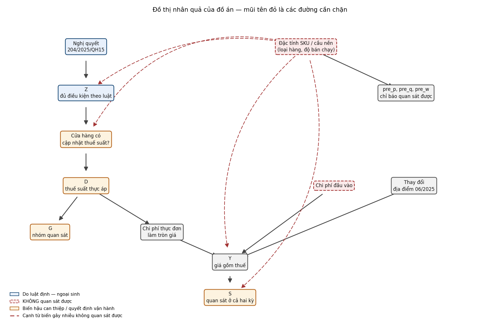

# Chương 4 — Thiết kế nhân quả

> Mọi con số trong chương này sinh từ [đặc tả khóa](../plans/2026-07-23-thue-gtgt-passthrough/dac-ta-khoa.md).

## 4.1 Đồ án bắt đầu từ đúng chỗ giáo trình dừng lại

Chương 8.6 của giáo trình định nghĩa ATE, trình bày cách ước lượng nó bằng thử nghiệm ngẫu nhiên có đối chứng, rồi dừng ở câu:

> *"Để ước lượng ATE trong các tình huống không thể thực hiện RCT, chúng ta cần các điều kiện bổ sung."*

Đồ án này bắt đầu từ đúng chỗ đó: chỉ ra **các điều kiện bổ sung ấy là gì**, và áp dụng **hai phương pháp ước lượng khác nhau** dưới cùng bộ điều kiện.

## 4.2 Câu hỏi nghiên cứu

> Việc giảm thuế GTGT từ 10% xuống 8% ngày 01/07/2025 có làm giảm giá bán lẻ mà người tiêu dùng thực trả không?

Cần phân biệt ba đại lượng thường bị gộp:

| | Ý nghĩa |
|---|---|
| **Giá chưa thuế** | Doanh thu về tay cửa hàng |
| **Quyết định định giá** | Cửa hàng chọn niêm yết bao nhiêu |
| **Giá gồm thuế** | Số tiền người tiêu dùng thực trả |

Chính sách tác động trực tiếp lên thuế suất. Việc nó có tới được **giá gồm thuế** hay không phụ thuộc quyết định định giá của cửa hàng. Đó là nội dung của khái niệm **pass-through**.

## 4.3 Thiết kế: thí nghiệm tự nhiên **có không tuân thủ**

Nghị quyết 204/2025/QH15 bỏ "sản phẩm hóa chất" khỏi danh mục loại trừ giảm thuế. Hàng chịu **thuế tiêu thụ đặc biệt** — rượu, bia, thuốc lá — bị loại trừ ở **cả hai** nghị quyết, nên giữ 10% suốt kỳ.

Đây là nguồn biến thiên ngoại sinh: quyết định do Quốc hội ban hành, không do cửa hàng.

**Nhưng dữ liệu cho thấy việc thực thi không hoàn hảo.** Phải tách hai đại lượng:

| | Định nghĩa | Do ai quyết định |
|---|---|---|
| **`Z`** | Đủ điều kiện giảm thuế **theo luật** | Quốc hội + loại sản phẩm |
| **`D`** | Thuế suất cửa hàng **thực áp** ở hậu kỳ | **Cửa hàng** |

| | Số SKU |
|---|---|
| `Z=1` — luật cho giảm | **155** |
| ↳ cửa hàng **đã** cập nhật (`D=1`) | 135 |
| ↳ cửa hàng **không** cập nhật (`D=0`) | **20** |
| **Tỉ lệ tuân thủ** | **87,1%** |
| `Z=0` — luật loại trừ (thuế TTĐB) | **132** |
| ↳ bị áp 8% trái luật | **0** |

20 SKU không tuân thủ là hàng hóa chất thật: COLGATE kem đánh răng, Garnier sữa rửa mặt, Gillette lưỡi dao cạo, mặt nạ Banobagi, BIORE lột mụn. Bằng chứng rõ nhất là **cùng dòng sản phẩm nằm ở hai nhóm khác nhau**: `Gillette Lưỡi Dao Cạo Mach 3 Clean` giữ 10%, trong khi `Gillette Dao cạo Mach 3 Clean` và 5 dao cạo Gillette khác chuyển sang 8%. Không có cách giải thích nào bằng luật.

⇒ Nếu chỉ so sánh theo `D`, ta đang **điều kiện hóa trên một quyết định vận hành của cửa hàng**, không phải trên luật.

## 4.4 Đơn vị phân tích và phạm vi suy rộng

| | |
|---|---|
| Đơn vị | **SKU** (mã vạch), sai phân trước–sau |
| Ước lượng đích | **ATT** — tác động lên chính nhóm được giảm thuế |
| Tổng thể đại diện | 155 SKU đủ điều kiện, có bán ở **cả** hai kỳ, tại **một** cửa hàng tiện lợi TP.HCM |

⚠️ **Không được ngoại suy ra ngành bán lẻ Việt Nam.** Một cửa hàng, một ngày chính sách, một người ra quyết định giá.

## 4.5 Đồ thị nhân quả

*Hình sinh từ `python code/chay_tat_ca.py`. Mũi tên đỏ nét đứt là các đường cần chặn — chúng đi
ra từ biến gây nhiễu **không quan sát được**, và đó là lý do đồ án chỉ trình bày kết quả là so
sánh có điều chỉnh. Khối `mermaid` dưới đây là cùng một đồ thị, giữ lại để đọc được trên GitHub
và để sửa nội dung dễ hơn hình.*

```mermaid
graph TD
    NQ["NQ 204/2025/QH15"]
    DT["Đặc tính SKU / cầu nền<br/>(loại hàng, độ bán chạy)<br/><i>không quan sát trực tiếp</i>"]
    Z["Z — đủ điều kiện theo luật"]
    CN["Cửa hàng cập nhật<br/>thuế suất?"]
    D["D — thuế suất thực áp"]
    G["G — nhóm quan sát<br/>T / C10 / C8"]
    PRE["pre_p, pre_q, pre_w<br/><i>chỉ báo quan sát được</i>"]
    CP["Chi phí đầu vào<br/><i>KHÔNG quan sát được</i>"]
    MC["Chi phí thực đơn<br/>làm tròn giá"]
    DD["Thay đổi liên quan địa điểm 06/2025"]
    Y["Giá gồm thuế<br/>(kết quả)"]
    S["S — được quan sát<br/>ở cả hai kỳ"]

    NQ --> Z
    DT --> Z
    DT --> PRE
    DT --> CN
    DT --> Y
    DT --> S
    Z --> CN
    CN --> D
    D --> G
    D --> MC
    MC --> Y
    CP --> Y
    DD --> Y
    Y --> S

    classDef an fill:#f5e6e6,stroke:#a33,stroke-dasharray:5 3
    classDef nguy fill:#fdf3e0,stroke:#b5651d
    class DT,CP an
    class CN,G,S nguy
```

**Bốn đường phải đọc được từ đồ thị:**

| # | Đường | Ý nghĩa |
|---|---|---|
| 1 | `Đặc tính SKU → Z` | Nghị quyết **không tự tạo ra** `Z`. Nghị quyết **kết hợp với loại sản phẩm** mới xác định đủ điều kiện |
| 2 | `Z → cửa hàng không cập nhật → D=10% → xếp vào C10` | Cơ chế ô nhiễm nhóm đối chứng |
| 3 | `Đặc tính SKU → pre_q, pre_w` **và** `→ Y` | Cùng một nguyên nhân ẩn vừa gây mất cân bằng, vừa ảnh hưởng xu hướng giá phản thực |
| 4 | `Đặc tính SKU → S ← Y` | Collider: mẫu chỉ giữ SKU có mặt ở cả hai kỳ, mà điều đó phụ thuộc chính giá |

Đường 1 là chỗ dễ vẽ sai nhất. Một DAG chỉ có `NQ → Z` sẽ làm can thiệp trông ngoại sinh hơn thực tế.

### Đường backdoor — cái nào chặn được

| Đường | Chặn bằng | Trạng thái |
|---|---|---|
| `Z ← Đặc tính SKU → Y` | `pre_p`, `pre_q`, `pre_w` (chỉ báo của đặc tính) | ⚠️ **Chặn không hoàn toàn** — chúng chỉ là chỉ báo, không phải biến ẩn |
| `D ← Cửa hàng cập nhật → Y` | — | 🔴 **Không chặn được.** Đây là lý do so sánh theo `Z` thay vì `D` |
| `Y ← Chi phí đầu vào` | — | 🔴 **Không quan sát được.** Hóa đơn mua vào chỉ có 03–04/2025, toàn bộ trước chính sách |
| `Y ← Thay đổi liên quan địa điểm` | Cửa sổ từ 11/06, gồm cả hai địa chỉ | ⚠️ Giảm nhẹ, không loại bỏ |
| Điều kiện hóa trên `S` | — | 🔴 **Không sửa được** bằng dữ liệu này |

**Không được điều chỉnh** cho `D`, `G`, `S`, hay bất kỳ biến nào sau can thiệp.

## 4.6 Khung Kết quả tiềm năng

Ký hiệu phải tách `Z` và `D`, nếu không thì phần lý thuyết nói tách nhưng ký hiệu lại gộp:

| Ký hiệu | Nghĩa |
|---|---|
| `D_i(z)` | Thuế thực nhận của SKU *i* nếu trạng thái đủ điều kiện là `z` |
| `Y_i(z, d)` | Thay đổi giá dưới chỉ định `z` và thuế thực nhận `d` |
| `Y_i(z=1)`, `Y_i(z=0)` | Dạng rút gọn cho so sánh theo `Z`. ⚠️ Trong đồ án này, mẫu đã điều kiện hóa **sống sót** nên đây không phải ITT vô điều kiện — xem [chương 6.5](chuong-06-suc-manh-va-co-che.md) |

Chỉ **dưới exclusion restriction** — `Z` không ảnh hưởng giá qua kênh nào khác ngoài `D` — mới rút gọn được về `Y_i(d)`.

**Vấn đề dữ liệu khuyết:** với mỗi SKU chỉ quan sát được một trong hai. `Y_i(z=0)` của nhóm đủ điều kiện là thứ **không bao giờ** quan sát được. Toàn bộ công việc còn lại là dựng ước lượng cho nó.

### Các giả định — và chúng đáng tin đến đâu

| Giả định | Nội dung | Đánh giá |
|---|---|---|
| **Xu hướng song song** | Nếu không có chính sách, giá hai nhóm biến động song song | ⚠️ Không kiểm chứng được đầy đủ. Chỉ có 2 hệ số dẫn |
| **Phân loại `Z` đúng** | Định danh sản phẩm phản ánh đúng địa vị pháp lý | ⚠️ 23 SKU chưa phân loại được → báo cáo 3 biến thể |
| **SUTVA** | Không lan tỏa giữa các SKU | 🔴 **Đáng ngờ.** Khăn ướt và khăn giấy thay thế nhau trong cùng cửa hàng; giảm giá nhóm này có thể kéo theo điều chỉnh nhóm kia |
| **No-anticipation** | Cửa hàng không đổi giá trước 01/07 để đón chính sách | ⚠️ Kiểm được phần nào bằng giả dược tiền kỳ |
| **Ổn định thành phần mẫu** | Bộ SKU không đổi hệ thống quanh ngày cắt | ⚠️ Có chọn lọc sống sót, xem đường 4 |
| **Không cú sốc trùng thời gian** | | 🔴 Dữ liệu trống 02–10/06; địa chỉ trên hóa đơn đổi hẳn từ 24/06. Không xác định được ngày dời vật lý |

## 4.7 Hai phương pháp — và điều chúng KHÔNG chứng minh được

Đồ án dùng **hai mô hình phân tích nhân quả khác nhau** theo yêu cầu đề bài: hồi quy có điều chỉnh (PP1) và phân tầng theo mức giá (PP2). Nhóm chạy thêm PP1-A thô và PP1-B g-computation để có hai biến thể so sánh.

| | Phương pháp 1 | Phương pháp 2 |
|---|---|---|
| Tên | Hồi quy ước lượng ATT | Phân tầng theo khung Kết quả tiềm năng |
| Neo giáo trình | Chương 9, 10 | Chương 8.4 (Simpson), 8.6 (ATE) |

🔴 **Cả hai dùng chung MỘT chiến lược nhận dạng: xu hướng song song.**

> Hai phương pháp cho kết quả tương tự **không** xác nhận quan hệ nhân quả. Cả hai cùng dựa trên giả định xu hướng song song; nếu giả định này sai, **cả hai cùng sai theo cùng một hướng**.

Dữ liệu này chỉ hỗ trợ một chiến lược nhận dạng: không có ngưỡng hồi quy gián đoạn, chỉ một cửa hàng. Khung Wald dùng `Z` theo kiểu công cụ, nhưng `Z` chỉ hợp lệ nếu **đã có** xu hướng song song theo `Z` — nó **nằm trong** cùng chiến lược, không độc lập với nó.

## 4.8 Nghịch lý Simpson và lý do phân tầng

Nghịch lý Simpson: một xu hướng xuất hiện trên toàn mẫu có thể **đảo chiều** khi tách theo nhóm nhỏ. Nguyên nhân là cơ cấu nhóm khác nhau giữa hai bên so sánh.

Phân tầng xử lý trực tiếp hiện tượng này: so sánh **trong từng tầng đồng nhất**, rồi trung bình có trọng số.

⚠️ **Phân tầng không tự động "xử lý Simpson" nếu chọn sai biến tầng.** Nhóm đã suýt chọn sai: thiết kế ban đầu định chia tầng theo biến `type`, cho tới khi phát hiện `type` là nhãn cấp **dòng hóa đơn** — 85% SKU mang nhiều hơn một nhãn, "Ly đá vừa" xuất hiện với cả ba nhãn *Nước uống*, *Đồ ăn*, *Sản phẩm khác*.

### Và trong đồ án này, phân tầng **không đạt cân bằng**

Cổng chẩn đoán được khóa **trước** khi chạy. Kết quả:

| Biến tiền kỳ | Trước phân tầng | Sau phân tầng theo giá |
|---|---|---|
| log(giá nền) | +0,010 ✅ | 3/5 tầng vượt ngưỡng |
| log(1+sản lượng) | **−0,870** 🔴 | 5/5 tầng vượt ngưỡng |
| Số tuần xuất hiện | **−0,601** 🔴 | 4/5 tầng vượt ngưỡng |

Đã thử **sáu** phương án chia tầng khác — theo sản lượng, theo số tuần, theo điểm tổng hợp, theo lưới hai chiều. **Không phương án nào đạt cân bằng.**

Đây là đặc điểm thật của dữ liệu chứ không phải lỗi kỹ thuật: rượu bia và hàng chăm sóc cá nhân khác nhau về bản chất luân chuyển. Không cách chia tầng nào theo biến quan sát được làm chúng giống nhau.

**Hệ quả — theo đúng quy tắc đã khóa trước:**

> Nhóm can thiệp và nhóm đối chứng khác nhau đáng kể về sản lượng và tần suất bán trước chính sách, và không phương án phân tầng nào theo biến quan sát được khắc phục được. Kết luận nhân quả của đồ án vì vậy **phụ thuộc hoàn toàn vào giả định xu hướng song song**, thứ mà dữ liệu này không cho phép kiểm chứng đầy đủ.

Cả hai phương pháp được trình bày là **so sánh có điều chỉnh**, không phải ước lượng nhân quả sạch.
